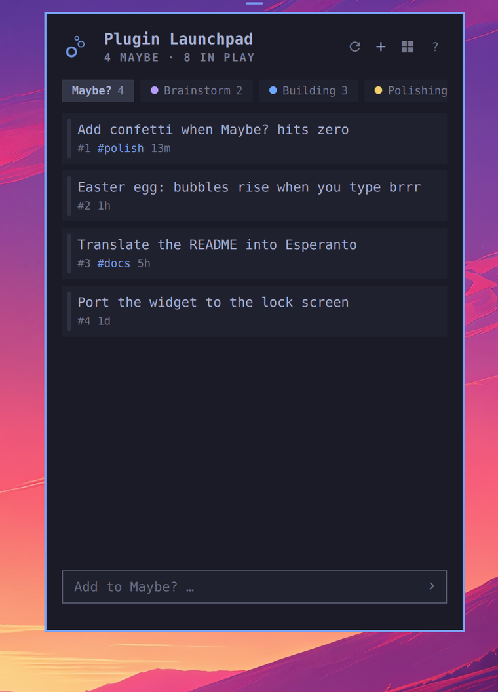
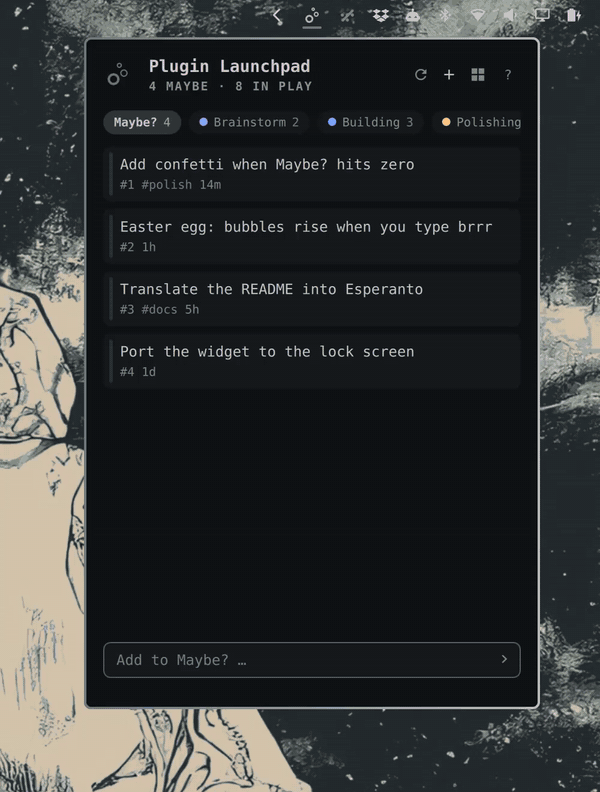
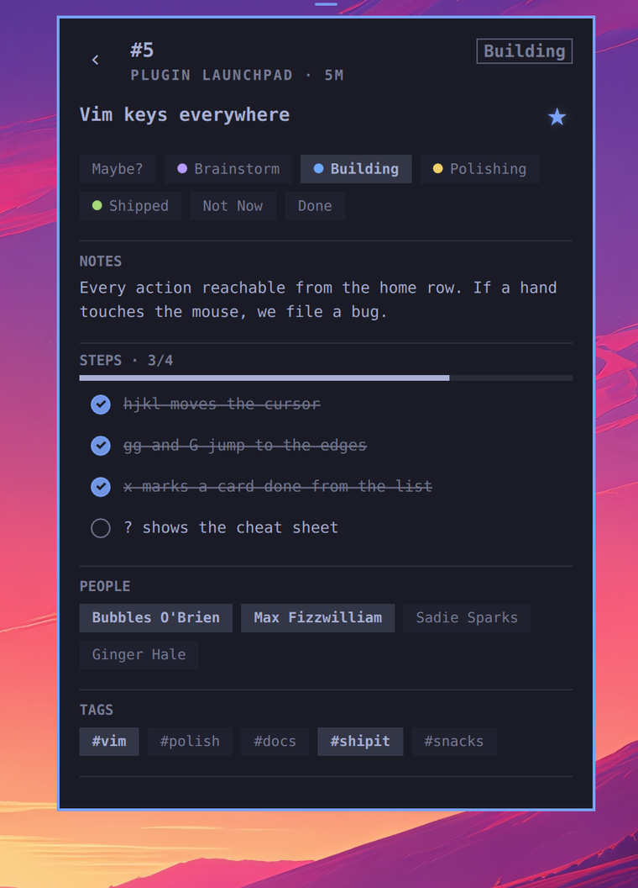
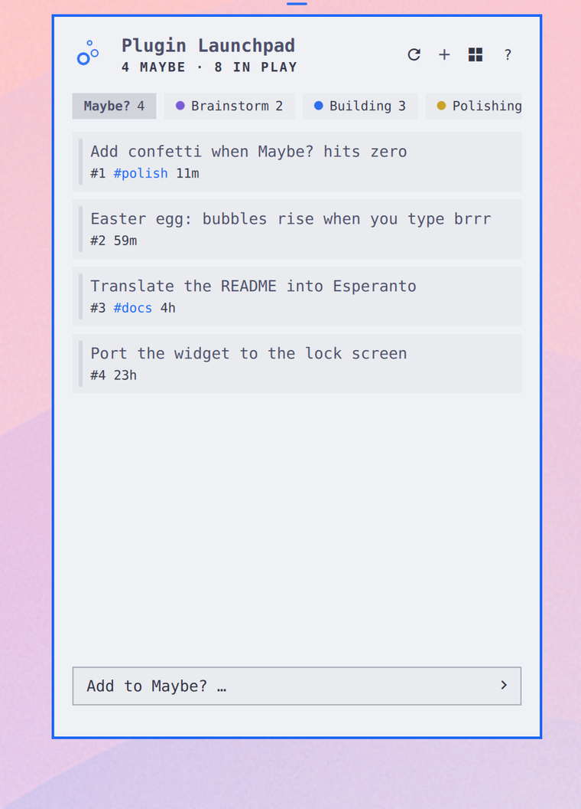
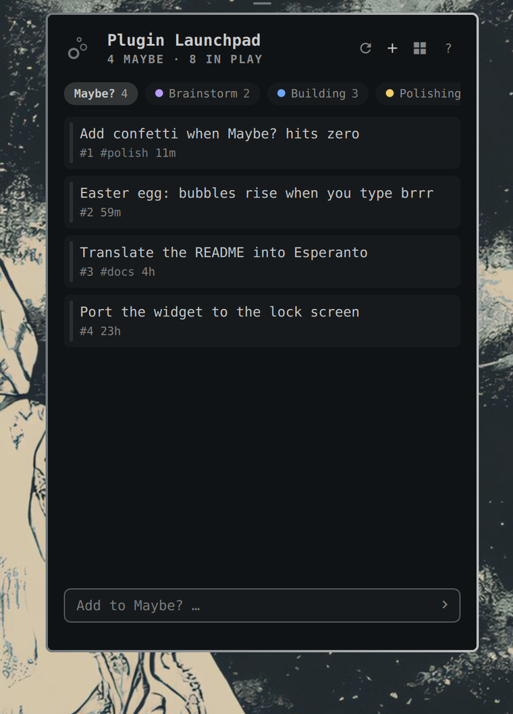

# Fizzy for Omarchy

[Fizzy](https://fizzy.do) is 37signals' delightfully simple kanban. This plugin puts it in your Omarchy bar: browse boards, triage cards, tick steps, write comments, and capture new ideas without leaving your desktop. All of it works from the keyboard, vim style. 🫧

<p align="center">
  
</p>

<p align="center"></p>

<p align="center"><a href="assets/demo.mp4">▶ Watch the full-quality demo (mp4, 15s)</a></p>

## What you get

- 🔴 **A bar badge that behaves.** The bubbles mark plus a live count of your Maybe? pile. Digits swap in a reserved cell with a quiet fade, so the clock next door never moves.
- 🗂️ **Boards and filters.** Switch between every board on your account. Filter chips for Maybe?, each column (in its own Fizzy color), Not Now, and Done.
- 🃏 **A full card page.** Move a card anywhere with one tap, read the notes, tick off steps, assign people, toggle tags, make it golden, and read or write comments.
- ✍️ **Two ways to capture.** Quick-add files straight to Maybe? from the board. The full composer adds notes, a destination column, tags, and people in one screen.
- ⌨️ **Vim at heart.** Every action is reachable from the home row. Press <kbd>?</kbd> for the cheat sheet.
- 🎨 **Native in every theme.** All colors come from Omarchy's theme tokens, with light and dark variants of Fizzy's own card palette.
- 🏠 **Your Fizzy, wherever it lives.** app.fizzy.do, your company's instance, or localhost — the address is part of connecting.

<p align="center">
  
</p>

## Keyboard

| Keys | Action |
| :--- | :--- |
| <kbd>j</kbd> / <kbd>k</kbd> or <kbd>↑</kbd> <kbd>↓</kbd> | Move the cursor, scroll a card |
| <kbd>h</kbd> / <kbd>l</kbd> or <kbd>←</kbd> <kbd>→</kbd> | Switch filter |
| <kbd>g</kbd><kbd>g</kbd> / <kbd>G</kbd> | Jump to first or last |
| <kbd>Enter</kbd> / <kbd>o</kbd> | Open the focused card |
| <kbd>a</kbd> | Focus quick-add, or the comment box on a card |
| <kbd>n</kbd> / <kbd>c</kbd> | Open the full composer |
| <kbd>x</kbd> | Mark the focused card done |
| <kbd>s</kbd> | Toggle golden |
| <kbd>1</kbd>…<kbd>9</kbd> | Jump straight to a filter |
| <kbd>r</kbd> | Refresh |
| <kbd>,</kbd> | Settings |
| <kbd>Tab</kbd> | Next bar panel |
| <kbd>Esc</kbd> | Back, then close |
| <kbd>?</kbd> | The cheat sheet |

## Install

```bash
omarchy plugin add https://github.com/ryanyogan/omarchy-fizzy.git --enable
```

Then add the Fizzy widget to your bar from the bar settings if it does not appear automatically.

## Connect your account

Open the widget, enter the address of your Fizzy — `app.fizzy.do`, or your own instance — and paste a personal access token. Get one in Fizzy under **Settings → API Tokens** (create it with read + write).

> [!NOTE]
> The token is stored in `~/.local/state/omarchy/settings/fizzy.json` with mode `0600` and is handed to `curl` through a private config file. It never appears on a process command line.

Your account is detected automatically. Pick a board and you are in business.

## Custom and self-hosted instances

The connect screen's **Fizzy address** field takes whatever you have:

| You type | It talks to |
| :--- | :--- |
| `fizzy.example.com` | `https://fizzy.example.com` |
| `https://fizzy.example.com/` | `https://fizzy.example.com` |
| `fizzy.example.com:3000` | `https://fizzy.example.com:3000` |
| `example.com/fizzy` | `https://example.com/fizzy` |
| `localhost:3000` | `http://localhost:3000` |

`https://` is assumed unless you type `http://` yourself; loopback addresses
(`localhost`, `127.0.0.1`, `[::1]`) default to `http://` because a dev
instance does not speak TLS. Leave the field empty for `app.fizzy.do`.

To move to another instance later, open the boards list and press 󰒋 in the
header. Tokens belong to one host, so you paste a fresh one — the old token is
never sent to the new instance. The selected board is cleared on a move,
because board ids belong to the host you left.

The address is stored as `base_url` in
`~/.local/state/omarchy/settings/fizzy.json` and can be set there directly:

```json
{ "base_url": "https://fizzy.example.com" }
```

Everything else — boards, cards, badge, shortcuts — works the same.

## Settings

Press <kbd>,</kbd> or the ⚙ in the panel header. Everything below is on that
page; it writes the same keys as `omarchy bar set` and the shell settings UI,
so the three never disagree.

| Key | Default | Meaning |
| :--- | ---: | :--- |
| `refreshIntervalSec` | `300` | Background poll for the bar badge |
| `showBadge` | `true` | Show the count next to the icon |
| `badgeSource` | `maybe` | What the count counts — `maybe`, `assigned to me`, `in play`, or `all open` |
| `tintOnTriage` | `true` | Tint the widget while cards are waiting, using the bar's own active color |
| `tintTarget` | `icon and count` | What the tint colors — `icon and count`, `count`, or `icon` |
| `showAvatars` | `false` | Draw people with their Fizzy picture instead of locally rendered initials |

Mouse extras on the bar icon: left click opens the panel, middle click refreshes, right click toggles the count badge.

> [!NOTE]
> `showAvatars` is off by default because it is the one setting that makes the
> shell fetch something it otherwise never would: people's pictures, from your
> Fizzy host. Comment HTML is scrubbed of remote images for the same reason.
> Only real uploaded pictures are ever loaded — Fizzy draws an SVG for everyone
> else, which Qt cannot render, and the local initials disc is better anyway.

## Themes

The panel is drawn entirely with Omarchy theme tokens, so it follows whatever theme you run. Here it is in Tokyo Night, Catppuccin Latte, and Solitude:

| Tokyo Night | Catppuccin Latte | Solitude |
| :---: | :---: | :---: |
|  |  |  |

## Requirements

`curl` and `jq`. Both ship with Omarchy.

## Remove

```bash
omarchy plugin remove ryanyogan.fizzy
```

Your token file is yours: delete `~/.local/state/omarchy/settings/fizzy.json` if you want it gone too.

## License

[MIT](LICENSE)
